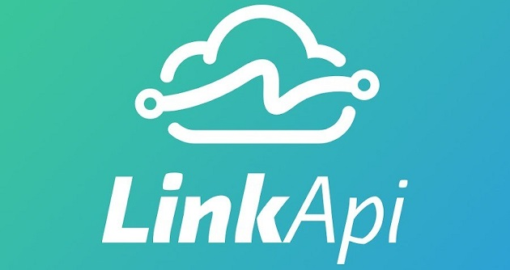

# LINKAPI - Desafio integração Pipedrive/Bling -

## :checkered_flag: Tecnologias

- NodeJS 14.18
- MongoDB (ATLAS)
- Swagger OAS3

Para usar o repositório, siga os passos:
<<<<<<< HEAD
> git clone https://github.com/maphstay/linkapi.git
=======
> clonar repositório: "git clone https://github.com/maphstay/linkapi.git"
>>>>>>> c1e3b79549c24fa0034f6cc06d06a57ec3fec2b5

> entrar na pasta: "cd .\linkapi\"

> instalar as dependências: "yarn"

> iniciar o servidor: "yarn dev"

> Documentação swagger para teste: <http://localhost:3000/api-docs>

<<<<<<< HEAD
> OBS: Pode ser testado pelo Postman/Insomnia através das rotas:
    > Listar: GET <http://localhost:3000/alldays>
    > Cadastrar: POST <http://localhost:3000/orders>
=======
> OBS: acessar src/services/createOrder.js, alterar a data na linha 37 para testar a gravação da soma dos pedidos em variadas datas
>>>>>>> c1e3b79549c24fa0034f6cc06d06a57ec3fec2b5

## :ledger: Descrição

1 - Criada uma API utilizando nodeJS e javascript a qual integra a plataforma Pipedrive com a Bling para cadastro de pedido que por sua vez a soma total dos valores de todos os pedidos filtrados pela data de emissão são armazenados no banco mongoDB.

2 - Seguindo o modelo MVC, utilizado o desacoplamento de código e boas práticas.

## :bust_in_silhouette: Autor

### Stefferson Thallys

---

This README was generated with ❤️ by <a href="https://www.linkedin.com/in/stefferson-thallys-6309851a2/">**Stefferson Thallys**</a>:copyright:

